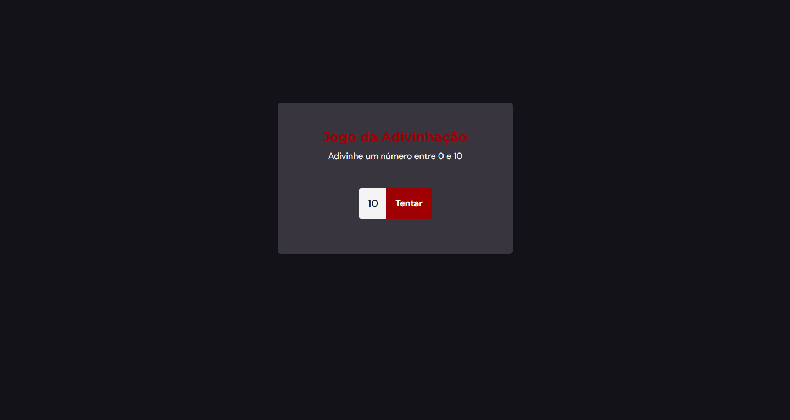

## Jogo da Adivinhação

> Trilha Explorer

Jogo da adivinhação construído no stage 5 (Avançando no JavaScript) trilha Explorer da Rocketseat.

Nesse projeto pude aprimorar mais os meus conceitos sobre o funcionamento e a manipulação da DOM(document object model), com mudanças de telas adicionan e removento tags que deixam os componente invisivei na tela. Com isso pude aplicar estes conceito em diversos outro projetos adquirindo mais familiaridade com ele.  
 - Abaixo está o link com o projeto funcional pronto para testes.

[🔗 Clique aqui para acessar](https://deploy-jogoadivinhacao.netlify.app/)

## 🛠️ Tecnologias

